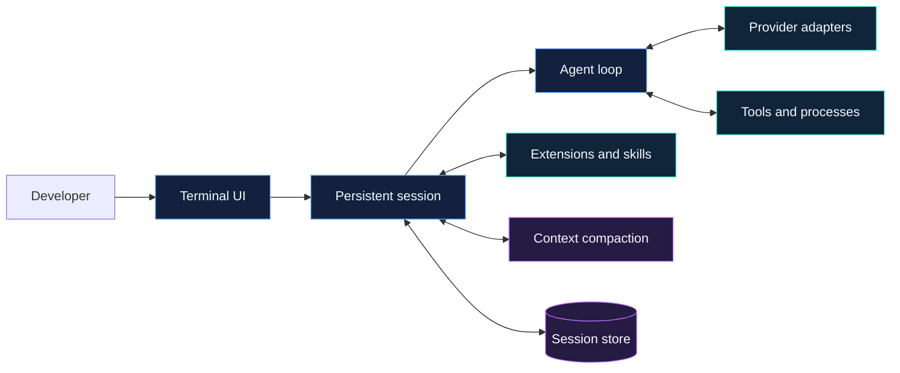

<p align="center">
  
</p>

<p align="center">
  <a href="LICENSE"></a>
  
  
  
</p>

<p align="center">
  <strong>A persistent, provider-neutral coding agent built for real development work.</strong><br>
  Bounded tools, managed processes, extensible workflows, and context compaction in one responsive terminal UI.
</p>

<p align="center">
  <a href="#quick-start">Quick start</a> ·
  <a href="#inside-the-runtime">Architecture</a> ·
  <a href="#extensions">Extensions</a> ·
  <a href="#context-and-compaction">Compaction</a> ·
  <a href="#production-sandbox">Sandbox</a> ·
  <a href="#verification">Verification</a>
</p>

---

## Built to keep working

Travis234 is designed for developers who want an agent to carry a task—not one they must constantly babysit. Sessions persist, long-running commands remain controllable, tool execution stays bounded, and context can be compacted without switching the active coding model.

<table>
  <tr>
    <td width="50%" valign="top">
      <h3>⚡ Responsive runtime</h3>
      Ordered tool results, bounded parallel execution, recoverable failures, cancellation, and repeated Ctrl-C escalation.
    </td>
    <td width="50%" valign="top">
      <h3>🧠 Durable context</h3>
      Persistent sessions, manual and automatic compaction, real-usage verification, and an optional dedicated summary model.
    </td>
  </tr>
  <tr>
    <td width="50%" valign="top">
      <h3>🔌 Provider neutral</h3>
      Per-model runtime bindings and provider-scoped credentials across OpenAI-compatible and native provider transports.
    </td>
    <td width="50%" valign="top">
      <h3>🧩 Extensible by design</h3>
      Global and project extensions, reloadable commands, lazy skills, custom tools, and bounded subagent workflows.
    </td>
  </tr>
  <tr>
    <td width="50%" valign="top">
      <h3>🛠 Managed processes</h3>
      Polling, streaming output, acknowledged stdin, interrupts, terminal-state recovery, and explicit cleanup.
    </td>
    <td width="50%" valign="top">
      <h3>🛡 Isolated execution</h3>
      An optional unprivileged Docker sandbox with dropped capabilities, isolated state, and no dotenv forwarding.
    </td>
  </tr>
</table>

## Quick start

### Run from source

Travis234 requires Python 3.13.

```bash
git clone https://github.com/htooayelwinict/travis234.git
cd travis234
python3.13 -m venv .venv
.venv/bin/pip install -e .
.venv/bin/travis234 --cwd .
```

Inside the TUI, use `/login` to authenticate, `/model` to select a model, and `/help` to see the complete command set.

Browser-development support is optional:

```bash
.venv/bin/pip install -e '.[browser]'
```

### Run through the npm sandbox launcher

```bash
npx @htooayelwinict/travis234 --cwd .
```

The npm package exposes only the `travis234` command and launches the release container with isolated Travis234 state.

> [!NOTE]
> The Python distribution is configured as `travis234`, but the public PyPI release is a separate release step. Until that release exists, install from source or use the npm launcher.

## Everyday controls

| Command | Purpose |
|---|---|
| `/login` | Authenticate with a supported provider |
| `/model` | Search and select the active model |
| `/session` | Inspect the current persistent session and context usage |
| `/compact` | Compact the current conversation immediately |
| `/reload` | Reload project and global extensions without restarting |
| `/processes` | Inspect managed and user-command processes |
| `/help` | Show available commands and shortcuts |
| `/exit` | Shut down cleanly and terminate owned work |

Use `!command` for an asynchronous operator command whose output is added to context. Use `!!command` when the output should remain outside model context.

## Inside the runtime



The core iteration loop owns ordering and bounded execution. Provider adapters translate model protocols without owning session policy. Extensions add commands, tools, hooks, providers, and subagents through explicit session-owned registrations. Compaction and persistence remain separate context owners.

## Providers and credentials

Provider credentials should be configured through `/login` or the provider's standard environment variable. Credentials loaded from `--dotenv` are registered only for the provider that declares them; switching models cannot reuse another provider's key.

The active worker binding can be explicit:

```dotenv
TRAVIS234_WORKER_LLM_PROVIDER=openrouter
TRAVIS234_WORKER_LLM_MODEL=xiaomi/mimo-v2.5
TRAVIS234_WORKER_LLM_CONTEXT_WINDOW=1048576
```

For a custom or newly released model whose catalog metadata is unavailable, set `TRAVIS234_WORKER_LLM_CONTEXT_WINDOW` to the provider's documented size. Footer telemetry and automatic compaction use this value as their denominator.

Model-driven subprocesses do not inherit provider credentials by default. A trusted project command can receive an exact allowlisted variable through `TRAVIS234_TOOL_ENV_PASSTHROUGH`. Human-authored `!command` remains an operator shell and inherits the operator environment.

## Context and compaction

Travis234 supports both manual compaction with `/compact` and automatic compaction at the configured context threshold. The default threshold is 50% of the effective model window, leaving recovery headroom across providers.

An auxiliary summarizer can compact context without changing the active coding model:

```dotenv
TRAVIS234_COMPRESSION_LLM_ENABLED=true
TRAVIS234_COMPRESSION_LLM_PROVIDER=openrouter
TRAVIS234_COMPRESSION_LLM_MODEL=openai/gpt-5.6-luna-pro
TRAVIS234_COMPRESSION_LLM_TIMEOUT_SECONDS=120
```

When required, add `TRAVIS234_COMPRESSION_LLM_BASE_URL` and `TRAVIS234_COMPRESSION_LLM_API_KEY`. Without an auxiliary route, compaction uses the active model. After compaction, Travis234 verifies effectiveness against the next real provider prompt instead of trusting only a local token estimate.

## Extensions

Travis234 discovers extensions from two locations:

```text
~/.travis234/agent/extensions/   # available across projects
.travis234/extensions/          # scoped to the current workspace
```

Install the optional first-party Hypa adapter with:

```bash
travis234 --install-extension hypa
```

The installer never overwrites an existing extension directory. Run `/reload` after adding or changing extension code; the TUI process does not need to restart.

Extensions execute with Travis234's permissions, so install only trusted code. JavaScript extensions do not execute directly in the Python runtime and require a Python adapter. See [the extension guide](travis/resources/docs/extensions.md) for the supported lifecycle and APIs.

## Skills and state

Travis234 keeps application state outside project workspaces:

```text
~/.travis234/agent/AGENTS.md
~/.travis234/agent/skills/
~/.travis234/agent/sessions/
~/.travis234/sandbox-home/
```

Workspace skills remain project-owned and load only when selected. Session history, compaction records, and extension state remain under the Travis234 state boundary.

Inside the sandbox, `/travis-home` is the application home and persisted session files live under `/travis-home/agent/sessions/`.

Useful overrides:

| Variable | Purpose |
|---|---|
| `TRAVIS234_CODING_AGENT_DIR` | Override the agent state root |
| `TRAVIS234_CODING_AGENT_SESSION_DIR` | Override persisted session storage |
| `TRAVIS234_SANDBOX_HOME` | Override host-side sandbox state |
| `TRAVIS234_IMAGE` | Select the runtime image |
| `TRAVIS234_SANDBOX_IMAGE` | Select the sandbox image explicitly |
| `TRAVIS234_SHARE_VIEWER_URL` | Configure the shared-session viewer |

## Managed processes

Long-running shell work can return a process handle instead of blocking the agent. The process API supports polling, acknowledged stdin writes, interrupts, and terminal-state recovery.

- `process.wait` waits for terminal state without changing the command timeout.
- A wait deadline does not kill the process; a later wait continues from the returned cursor.
- Live output is bounded to 64 MiB per process and reports `output_limit` when crossed.
- Completed metadata is retained for bounded recovery.
- Running processes cannot be reattached after an application restart.

## Production sandbox

The release image runs as the unprivileged `travis` user. The npm launcher mounts only the chosen workspace and isolated Travis234 state, drops Linux capabilities, enables `no-new-privileges`, and does not forward a dotenv file.

```bash
travis234 --cwd /path/to/project
```

Default image: `ghcr.io/htooayelwinict/travis234`

## Verification

### Local gates

```bash
PYTHONPATH=. .venv/bin/python -m pytest tests -q
npm --prefix packages/travis234-cli test
npm --prefix packages/travis234-cli run pack:dry-run
python -m build
```

The repository also carries focused architecture, provider, compaction, process-ownership, cancellation, extension, installed-wheel, container, and release-contract tests. See the [full verification record](docs/verification/full-suite.md).

### Manual 21-prompt TUI acceptance

Production acceptance uses the real installed console entry point in an attached background PTY—not the eval runner, a scripted prompt driver, or `python -m travis.cli`.

```bash
TRAVIS234_CODING_AGENT_DIR=/tmp/travis234-acceptance/agent \
uv run travis234 \
  --cwd /tmp/travis234-acceptance/workspace \
  --dotenv .env \
  --temperature 0.2 \
  --thinking high \
  --event-trace /tmp/travis234-acceptance/events.jsonl \
  --conversation-log /tmp/travis234-acceptance/conversation.jsonl
```

Run `/model mimo`, select `openrouter/xiaomi/mimo-v2.5`, and enter the 21 scenarios in `evals/scenarios.json` manually, one at a time. For every completed prompt:

1. Wait until the TUI is idle and inspect the final answer.
2. Verify edits, tool choices, persistence, process ownership, and recovery behavior.
3. Record footer tokens, context percentage, and compaction state.
4. Run the scenario verifier outside the TUI.
5. Classify failures as model quality, provider translation, context management, runtime/tooling, or environment behavior.

The same session must exercise extension creation and `/reload`, lazy skill loading, a reviewer subagent, managed process stdin and cancellation, repeated Ctrl-C escalation, `/session`, manual `/compact`, automatic compaction, and a dependent post-compaction prompt. Exit with `/exit` and confirm that no owned process remains.

A paid provider failure stops the run for diagnosis. A weak model answer is recorded as model quality and does not, by itself, justify a runtime change.

## Distribution identity

| Surface | Contract |
|---|---|
| Product and repository | `Travis234` / `travis234` |
| Python distribution | `travis234` |
| Python import package | `travis` |
| CLI command | `travis234` |
| npm package | `@htooayelwinict/travis234` |
| Container image | `ghcr.io/htooayelwinict/travis234` |
| Container user | `travis` |
| Environment prefix | `TRAVIS234_*` |

This is a hard cutover. Legacy runtime aliases, state paths, and migration fallbacks are not supported.

## License

Travis234 is distributed under the [MIT License](LICENSE). See [NOTICE.md](NOTICE.md) for attribution and notices.

<p align="center">
  <strong>Travis234</strong><br>
  Built for developers who need the agent to keep working.
</p>
