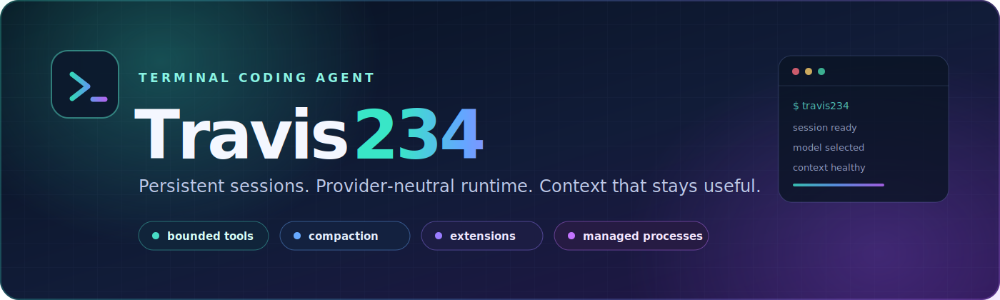
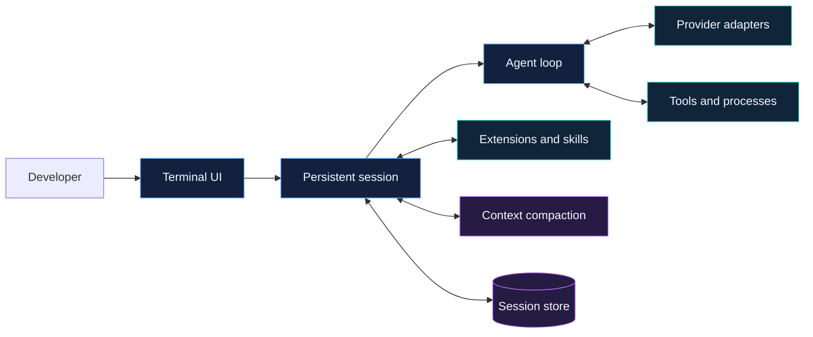

<p align="center">
  
</p>

```text
TRAVIS234 // NEURAL TERMINAL ONLINE
[AGENT:READY] [CONTEXT:COMPACT] [TOOLS:BOUNDED] [RUNTIME:PERSISTENT]
```

<p align="center">
  <a href="LICENSE"></a>
  
  
  
</p>

<p align="center">
  <strong>A persistent, provider-neutral coding agent built for real development work.</strong><br>
  Bounded tools, managed processes, extensible workflows, and context compaction in one responsive terminal UI.
</p>

<p align="center">
  <a href="#quick-start">Quick start</a> ·
  <a href="#inside-the-runtime">Architecture</a> ·
  <a href="#extensions">Extensions</a> ·
  <a href="#context-and-compaction">Compaction</a> ·
  <a href="#production-sandbox">Sandbox</a> ·
  <a href="#verification">Verification</a>
</p>

---

## Built to keep working

Travis234 is designed for developers who want an agent to carry a task—not one they must constantly babysit. Sessions persist, long-running commands remain controllable, tool execution stays bounded, and context can be compacted without switching the active coding model.

<table>
  <tr>
    <td width="50%" valign="top">
      <h3>⚡ Responsive runtime</h3>
      Ordered tool results, bounded parallel execution, recoverable failures, cancellation, and repeated Ctrl-C escalation.
    </td>
    <td width="50%" valign="top">
      <h3>🧠 Durable context</h3>
      Persistent sessions, manual and automatic compaction, real-usage verification, and an optional dedicated summary model.
    </td>
  </tr>
  <tr>
    <td width="50%" valign="top">
      <h3>🔌 Provider neutral</h3>
      Per-model runtime bindings and provider-scoped credentials across OpenAI-compatible and native provider transports.
    </td>
    <td width="50%" valign="top">
      <h3>🧩 Extensible by design</h3>
      Global and project extensions, reloadable commands, lazy skills, custom tools, and bounded subagent workflows.
    </td>
  </tr>
  <tr>
    <td width="50%" valign="top">
      <h3>🛠 Managed processes</h3>
      Polling, streaming output, acknowledged stdin, interrupts, terminal-state recovery, and explicit cleanup.
    </td>
    <td width="50%" valign="top">
      <h3>🛡 Isolated execution</h3>
      An optional unprivileged Docker sandbox with dropped capabilities, isolated state, and no dotenv forwarding.
    </td>
  </tr>
</table>

## Quick start

### Install from PyPI

Install the persistent CLI with [uv](https://docs.astral.sh/uv/):

```bash
uv tool install --python 3.13 travis234
travis234 --cwd .
```

Run it once without a persistent installation:

```bash
uvx --python 3.13 travis234 --cwd .
```

Or install it with pip:

```bash
python3.13 -m pip install travis234
travis234 --cwd .
```

Upgrade an existing uv tool installation with `uv tool upgrade travis234`. The public Python package is available at [PyPI](https://pypi.org/project/travis234/) and requires Python 3.13.

### Run from source

Travis234 requires Python 3.13.

```bash
git clone https://github.com/htooayelwinict/travis234.git
cd travis234
python3.13 -m venv .venv
.venv/bin/pip install -e .
.venv/bin/travis234 --cwd .
```

Inside the TUI, use `/login` to authenticate, `/model` to select a model, and `/help` to see the complete command set.

### Automation and controlled startup

All transports use the same `CodingApp`, `AgentSession`, persistence, trust, tool, and compaction owners:

```bash
# Final assistant text only
.venv/bin/travis234 --cwd . --mode print "Inspect the failing test"

# Versioned JSON Lines lifecycle stream
.venv/bin/travis234 --cwd . --mode json "Inspect the failing test"

# Newline-delimited request/response RPC on stdin/stdout
.venv/bin/travis234 --cwd . --mode rpc
```

Machine modes never prompt for project trust. Unknown projects remain untrusted unless `--approve`, `--no-approve`, or a saved policy decides them. `--offline` disables catalog refresh, OAuth refresh that requires a network, and non-local package acquisition while retaining cached models, stored credentials, and local resources.

Tool and resource controls are applied before the system prompt and context envelope are built:

```bash
.venv/bin/travis234 --cwd . --tools read,grep,find --exclude-tools bash \
  --extension ./trusted-extension.py --skill ./skills/review/SKILL.md \
  --prompt-template ./prompts/audit.md --theme ./themes/night.json \
  --mode print '@README.md review this file'
```

`--tools` and `--exclude-tools` are repeatable comma-separated lists; `--no-tools` disables every tool unless an explicit allowlist adds one back. Explicit resource paths are operator-authorized for that process and are validated without fallback searching. `@file`, quoted `@"path with spaces"`, and repeatable `--image PATH` inputs are expanded with read-tool size bounds before provider submission. The legacy `--plain` interactive alias remains for compatibility and is planned for removal in 3.0.

Browser-development support is optional:

```bash
.venv/bin/pip install -e '.[browser]'
```

### Run through the npm sandbox launcher

```bash
npx @htooayelwinict/travis234 --cwd .
```

The npm package exposes only the `travis234` command and launches the release container with isolated Travis234 state.

## Everyday controls

| Command | Purpose |
|---|---|
| `/login` | Authenticate with a supported provider |
| `/model` | Search and select the active model |
| `/params [name [value] \| reset [name]]` | Inspect or change durable model parameters for the active session |
| `/session` | Inspect the current persistent session and context usage |
| `/name`, `/fork`, `/clone`, `/tree` | Name, branch, clone, or navigate the JSONL v3 session tree |
| `/resume`, `/new` | Switch to another indexed session or start a new one |
| `/export`, `/import`, `/copy`, `/share` | Move or present session data through explicit local/platform adapters |
| `/compact [focus]`, `/compress [focus]` | Safely summarize older history while retaining a recent raw suffix; skip when compression would grow context |
| `/compact deep [focus]`, `/compress deep [focus]` | Create an aggressive bounded generational checkpoint with no retained raw suffix |
| `/reload` | Reload project and global extensions without restarting |
| `/theme` | Select a discovered theme |
| `/trust` | View or change project trust; reload before newly trusted code runs |
| `/packages` | List installed resource packages (`--local` selects project scope) |
| `/install`, `/remove`, `/update` | Confirm and manage local, Git, or Python resource packages |
| `/processes` | Inspect managed and user-command processes |
| `/help` | Show available commands and shortcuts |
| `/exit` | Shut down cleanly and terminate owned work |

User `!command` and `!!command` run asynchronously. Output from `!command` is added to context; `!!command` output remains outside model context.

### Session generation parameters

`/params` is a direct, non-picker session control. It reports the active provider/model, thinking level, effective generation parameters, value sources, and any provider-capability warnings.

```text
/params
/params temperature
/params temperature 0.2
/params thinking high
/params stop END,STOP
/params reset temperature
/params reset
```

The editable generation fields are `temperature`, `top_p`, `max_tokens`, `timeout_seconds`, `frequency_penalty`, `presence_penalty`, `seed`, `parallel_tool_calls`, `tool_choice`, `stop`, and `provider_sort`. `thinking` uses the model-aware session reasoning control and stays independent from the generation override map.

Generation changes are local to the active JSONL session, survive resume and branch operations, and apply on the next Agent turn. A resumed session wins only for fields explicitly changed there; untouched fields continue to inherit the current provider, dotenv, and startup CLI configuration. `/params reset <name>` removes one session override and reveals the inherited value, while `/params reset` removes every generation override without changing thinking. Use explicit `reset` syntax—`none`, `null`, and empty values are rejected.

Writes are rejected while an Agent turn is active, but read-only `/params` queries remain available. Valid settings that the selected provider cannot use remain saved and are reported as `dropped`; switching to a compatible model can activate them later. Context and output safety remain authoritative, so request-time limits may lower `max_tokens`. These session overrides affect the interactive main Agent turn, including its tool continuations and retries; compaction and auxiliary summarizer calls keep their existing parameter policy.

### Terminal history and selection

Travis234 renders complete logical output into the terminal's normal buffer. The terminal—not the agent—owns wheel and touchpad scrolling, drag selection, clickable links, and terminal or tmux history. PageUp, PageDown, Home, and End are passed to the focused TUI component; Shift+PageUp and Shift+PageDown follow the terminal's own configuration.

Real PTY resize events are tracked through `SIGWINCH`; the active screen repaints at the new width without erasing native scrollback.

Mouse reporting is disabled by default, including in the release sandbox, so ordinary text selection remains available. `TRAVIS234_TUI_MOUSE=1` is an explicit diagnostic opt-in; many terminals disable normal selection, URL interaction, and tmux scrollback while mouse reporting is active.

### Themes and multiline input

The built-in semantic themes are **Signal Glass**, **Black Ice**, **Neon Oni**, **Blood Circuit**, **Reactor Gold**, and **Polar Ghost**. Run `/theme` to open the live preview: arrow keys preview without persistence, Escape restores the exact original palette, and Enter returns the selection to the existing `/theme` command for the single persisted commit.

External Pi-compatible JSON themes may provide any subset of the semantic colors. Missing roles inherit from Signal Glass. Values may be strict `#RRGGBB`, xterm indices `0..255`, an empty string for the terminal default, or references into `vars`; malformed roles fall back locally and never enter the agent context. `NO_COLOR=1` or `TERM=dumb` keeps the same semantic text with no ANSI color.

The main prompt is multiline. Enter submits the complete prompt; Shift+Enter inserts a newline when the terminal reports modified Enter, and Alt+Enter is the portable fallback. Arrow keys move through lines while preserving the visual column. Dialog, search, password, and picker fields remain single-line.

## Inside the runtime



The core iteration loop owns ordering and bounded execution. Provider adapters translate model protocols without owning session policy. Extensions add commands, tools, hooks, providers, and subagents through explicit session-owned registrations. Compaction and persistence remain separate context owners.

### Python SDK surfaces

`AgentHarness` is the async composition root for applications that need the same session, resource, tool, and compaction owners without a TUI. `Models.async_api()` provides event-loop-safe model discovery, `stream_proxy()` provides ordered transform/callback forwarding, and the optional image registry remains separate from chat-model selection.

```python
from travis import AgentHarness, AgentHarnessConfig

async with AgentHarness.create(
    AgentHarnessConfig(cwd=".", model=model, trust_override=False)
) as harness:
    message = await harness.prompt("Inspect the failing test")
```

Image APIs are exported from `travis.ai`: `ImageModel`, `ImageGenerationOptions`, `generate_images`, and `register_image_provider`. They do not load an image provider or add image-model schemas to ordinary chat requests unless explicitly invoked.

## Providers and credentials

Provider credentials should be configured through `/login` or the provider's standard environment variable. Credentials loaded from `--dotenv` are registered only for the provider that declares them; switching models cannot reuse another provider's key.

The active worker binding can be explicit:

```dotenv
TRAVIS234_WORKER_LLM_PROVIDER=openrouter
TRAVIS234_WORKER_LLM_MODEL=xiaomi/mimo-v2.5
TRAVIS234_WORKER_LLM_CONTEXT_WINDOW=1048576
```

For a custom or newly released model whose catalog metadata is unavailable, set `TRAVIS234_WORKER_LLM_CONTEXT_WINDOW` to the provider's documented size. Footer telemetry and automatic compaction use this value as their denominator.

Model-driven subprocesses do not inherit provider credentials by default. A trusted project command can receive an exact allowlisted variable through `TRAVIS234_TOOL_ENV_PASSTHROUGH`. Human-authored `!command` remains an operator shell and inherits the operator environment.

## Context and compaction

Travis234 supports conservative manual compaction with `/compact [focus]`, aggressive manual-only compaction with `/compact deep [focus]`, and automatic compaction against the effective input window (the selected route's context window minus its reserved output). Normal `/compact` and automatic compaction retain a protected recent raw suffix so active work stays verbatim. Normal manual compaction safely makes no changes when its generated summary would increase context. The Hermes-aligned automatic default triggers at 75% for routes below 512K and 50% for larger routes. Routes below 64K use a reachable 85% fallback instead of an impossible fixed floor.

`/compact deep` is an explicit fresh-envelope checkpoint for completed work. It replaces the live conversation with one standalone handoff and retains no pre-checkpoint raw suffix. The handoff targets 2,048 estimated tokens; one validation-repair pass may use an absolute 4,096-token ceiling. Large tool results and arguments are bounded before summarization, private reasoning is excluded, sensitive text is redacted, and recent read/modified file anchors are carried forward. Earlier JSONL records remain append-only session history, but they are not replayed into the next provider request.

Deep compaction is atomic and fail-closed. It refuses unanswered users, aborted or errored assistants, unfinished tool turns, insufficient summarizer capacity, invalid or secret-shaped output, and checkpoints that do not save at least 256 tokens or 5%. A refusal preserves the exact live messages and appends no compaction entry. Use normal `/compact` during active implementation when recent turns should remain verbatim; use `/compact deep` after a clean completed turn when reclaiming the context envelope matters more than raw conversational detail. The optional `focus` text tells either summarizer what to prioritize.

An auxiliary summarizer can compact context without changing the active coding model:

```dotenv
TRAVIS234_COMPRESSION_LLM_ENABLED=true
TRAVIS234_COMPRESSION_LLM_PROVIDER=openrouter
TRAVIS234_COMPRESSION_LLM_MODEL=openai/gpt-5.6-luna-pro
TRAVIS234_COMPRESSION_LLM_TIMEOUT_SECONDS=120
```

When required, add `TRAVIS234_COMPRESSION_LLM_BASE_URL` and `TRAVIS234_COMPRESSION_LLM_API_KEY`. Without an auxiliary route, compaction uses the active model. A smaller auxiliary route lowers the live trigger so its summary request fits before the main route overflows. After compaction, Travis234 publishes a full-request estimate (system prompt, active tool schemas, messages, images, and provider replay metadata), then verifies it against the next real provider prompt.

Context pressure counts provider input plus cache-read/cache-write input; generated output is retained for billing statistics but does not make the next prompt larger. This is why a large answer no longer causes premature compaction. Existing JSONL sessions require no migration: summaries, route changes, and the new confidence/component telemetry are re-derived when a session is resumed.

## Extensions

Travis234 discovers extensions from two locations:

```text
~/.travis234/agent/extensions/   # available across projects
.travis234/extensions/          # scoped to the current workspace
```

Install the optional first-party Hypa adapter with:

```bash
travis234 --install-extension hypa
```

The installer never overwrites an existing extension directory. Run `/reload` after adding or changing extension code; the TUI process does not need to restart.

Extensions can register typed, long-form CLI flags:

```python
def extension(travis):
    travis.register_flag("verbose", {"type": "boolean", "description": "Verbose output"})
    travis.register_flag("profile", {"type": "string", "description": "Select a profile"})
```

Load an explicitly trusted extension and pass its flags before the prompt:

```bash
travis234 --extension ./trusted-extension.py --profile security --verbose "inspect this repository"
```

Authorized extension flags appear in `--help`. Boolean flags never consume the following prompt; string flags require a value, and a repeated string flag uses the last value. Use `--` to keep option-shaped text in the prompt instead of parsing it as a flag.

Flag values are process-local, are reapplied when the app replaces its active session, and are not written to settings or session history. Project-only flag schemas require explicit or saved trust before they become valid CLI options. Registering a flag adds no core context-envelope tokens; context grows only if the extension uses that value to enable prompt text, tools, or another context-bearing resource.

Extensions execute with Travis234's permissions, so install only trusted code. Unknown workspaces fail closed: project settings, extensions, skills, prompts, themes, and project system-prompt files stay disabled until trust is resolved. Use `--approve` or `--no-approve` for a process-only CLI decision, or `/trust` to save a folder/parent decision; `/trust` never executes project code by itself. Global resources under `~/.travis234/agent/` remain available during trust resolution. Travis JavaScript extensions do not run directly in the Python runtime and require a Python adapter. See [the extension guide](travis/resources/docs/extensions.md) for the supported lifecycle and APIs.

Resource files use safe YAML frontmatter. Discovery merges `.gitignore`, `.ignore`, and `.fdignore`; an explicitly named file remains an operator-selected exception. Leading `/template` prompts expand shell-quoted `$ARGUMENTS`, `$1`, and related Pi placeholders before provider submission. When `enableSkillCommands` is enabled, `/skill:<name>` injects only the selected skill. Discovered themes are reloadable, and extension UI code can select them with `setTheme`.

Packages can be local directories, `git+https://...@revision` sources, or pinned Python requirements. Global commands use `travis234 install|remove|update|list`; add `--local` for trusted project scope. Installs replace atomically, ordinary startup never auto-updates packages, and package subprocesses do not receive model-provider, worker, compression, OAuth, or ambient token credentials.

## Skills and state

Travis234 keeps application state outside project workspaces:

```text
~/.travis234/agent/AGENTS.md
~/.travis234/agent/skills/
~/.travis234/agent/sessions/
~/.travis234/sandbox-home/
```

Workspace skills remain project-owned and load only when selected. Session history, compaction records, and extension state remain under the Travis234 state boundary.

Inside the sandbox, `/travis-home` is the application home and persisted session files live under `/travis-home/agent/sessions/`.

Useful overrides:

| Variable | Purpose |
|---|---|
| `TRAVIS234_CODING_AGENT_DIR` | Override the agent state root |
| `TRAVIS234_CODING_AGENT_SESSION_DIR` | Override persisted session storage |
| `TRAVIS234_SANDBOX_HOME` | Override host-side sandbox state |
| `TRAVIS234_IMAGE` | Select the runtime image |
| `TRAVIS234_SANDBOX_IMAGE` | Select the sandbox image explicitly |
| `TRAVIS234_SHARE_VIEWER_URL` | Configure the shared-session viewer |

## Managed processes

Long-running shell work can return a process handle instead of blocking the agent. The process API supports polling, acknowledged stdin writes, interrupts, and terminal-state recovery.

- `process.wait` waits for terminal state and does not change the command timeout.
- If a wait deadline expires, the command is not killed; a later wait continues from the returned cursor.
- Live output is bounded to 64 MiB per process and reports `output_limit` when crossed.
- Completed metadata is retained for bounded recovery.
- Travis234 cannot reattach a running process after an application restart.

## Production sandbox

The release image runs as the unprivileged `travis` user. The npm launcher mounts only the chosen workspace and isolated Travis234 state, drops Linux capabilities, enables `no-new-privileges`, and does not forward a dotenv file.

```bash
travis234 --cwd /path/to/project
```

Default image: `ghcr.io/htooayelwinict/travis234`

## Verification

### Local gates

```bash
PYTHONPATH=. .venv/bin/python -m pytest tests -q
npm --prefix packages/travis234-cli test
npm --prefix packages/travis234-cli run pack:dry-run
python -m build
.venv/bin/python scripts/verify_acceptance.py --parity-json
```

The parity report maps 78 pinned Pi behaviors—including all 33 extension events—and 11 Hermes compaction behaviors to concrete tests, with intentional Travis safety divergences called out explicitly. The repository also carries focused architecture, provider, compaction, process-ownership, cancellation, extension, installed-wheel, container, and release-contract tests. See the [full verification record](docs/verification/full-suite.md).

### Manual 21-prompt TUI acceptance

Production acceptance uses the real installed console entry point in an attached background PTY—not the eval runner, a scripted prompt driver, or `python -m travis.cli`.

```bash
TRAVIS234_CODING_AGENT_DIR=/tmp/travis234-acceptance/agent \
uv run travis234 \
  --cwd /tmp/travis234-acceptance/workspace \
  --dotenv .env \
  --temperature 0.2 \
  --thinking high \
  --event-trace /tmp/travis234-acceptance/events.jsonl \
  --conversation-log /tmp/travis234-acceptance/conversation.jsonl
```

Run `/model mimo`, select `openrouter/xiaomi/mimo-v2.5-pro`, and enter the 21 scenarios in `evals/scenarios.json` manually, one at a time. For every completed prompt:

1. Wait until the TUI is idle and inspect the final answer.
2. Verify edits, tool choices, persistence, process ownership, and recovery behavior.
3. Record footer tokens, context percentage, and compaction state.
4. Run the scenario verifier outside the TUI.
5. Classify failures as model quality, provider translation, context management, runtime/tooling, or environment behavior.

The same session must exercise extension creation and `/reload`, lazy skill loading, a reviewer subagent, managed process stdin and cancellation, repeated Ctrl-C escalation, `/session`, manual `/compact`, automatic compaction, and a dependent post-compaction prompt. Exit with `/exit` and confirm that no owned process remains.

A paid provider failure stops the run for diagnosis. A weak model answer is recorded as model quality and does not, by itself, justify a runtime change.

### Five-scenario native-TUI acceptance

Use this shorter protocol for scrollback, selection, themes, Markdown, tools, resize, and multiline regressions. It must use the installed `travis234` console entry point in a real PTY with isolated state—not `python -m`, a fake terminal, or the eval runner.

```bash
rm -rf /tmp/travis234-tui-acceptance
mkdir -p /tmp/travis234-tui-acceptance/workspace
cp README.md /tmp/travis234-tui-acceptance/workspace/README.md
TRAVIS234_CODING_AGENT_DIR=/tmp/travis234-tui-acceptance/agent \
uv run travis234 \
  --cwd /tmp/travis234-tui-acceptance/workspace \
  --dotenv .env \
  --temperature 0.2 \
  --thinking high
```

Run `/model mimo`, select `openrouter/xiaomi/mimo-v2.5-pro`, then complete these five prompts in the same session:

1. `Return a numbered diagnostic checklist with 80 short lines, then end with NATIVE-HISTORY-END.` Scroll with the wheel/touchpad, Shift+PageUp/PageDown or tmux history; drag-select lines near the top and copy them. The prompt must remain usable at the live bottom.
2. `Show a compact Markdown demo containing a heading, quote, bullets, ordered steps, inline code, a fenced diff, a link, and a two-column table.` Verify semantic styling, clickable-link behavior when supported, clean narrow-table fallback, and no raw Markdown fences.
3. Enter `Explain the difference between` then insert a newline with Shift+Enter or Alt+Enter, enter `terminal scrollback and an application viewport`, and submit with Enter. Verify that the provider receives one prompt containing the newline and that Up/Down preserves the intended column before submission.
4. `Read README.md and report only its product name, Python version, and the six built-in TUI theme names.` Verify pending/success tool surfaces, stable output ordering, and that selection/copy remain terminal-native while the tool runs.
5. Preview Neon Oni, cancel, preview Blood Circuit, commit, resize through roughly 40/80/120 columns, then enter `Reply exactly: THEME-RESIZE-OK`. Verify exact preview restoration, persisted commit, bounded line widths, visible context pressure, and a clean final prompt.

Repeat scenario 1 with `NO_COLOR=1`, and once inside tmux when available. Exit with `/exit`; the terminal must restore cursor, bracketed-paste, and mouse state without deleting native history.

## Distribution identity

| Surface | Contract |
|---|---|
| Product and repository | `Travis234` / `travis234` |
| Python distribution | `travis234` |
| Python import package | `travis` |
| CLI command | `travis234` |
| npm package | `@htooayelwinict/travis234` |
| Container image | `ghcr.io/htooayelwinict/travis234` |
| Container user | `travis` |
| Environment prefix | `TRAVIS234_*` |

This is a hard cutover. Legacy runtime aliases, state paths, and migration fallbacks are not supported.

## License

Travis234 is distributed under the [MIT License](LICENSE). See [NOTICE.md](NOTICE.md) for attribution and notices.

<p align="center">
  <strong>Travis234</strong><br>
  Built for developers who need the agent to keep working.
</p>
