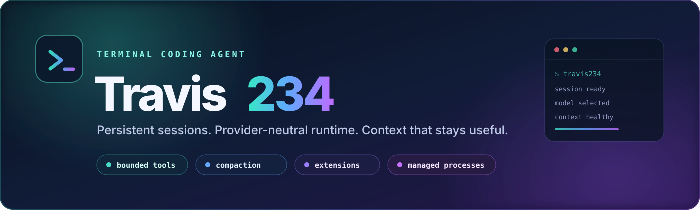

<p align="center">
  
</p>

```text
TRAVIS234 // NEURAL TERMINAL ONLINE
[AGENT:READY] [CONTEXT:COMPACT] [TOOLS:BOUNDED] [RUNTIME:PERSISTENT]
```

<p align="center">
  <a href="LICENSE"></a>
  
  
</p>

# Travis234 OffSec

Travis234 OffSec is a provider-neutral tactical security agent for CTF and lab
work, offensive-security research, DFIR, incident response, malware analysis,
and security engineering. It keeps the proven Travis234 runtime: ordered tool
execution, managed interactive processes, bounded writable subagents, persistent
sessions, extensions, lazy skills, and manual or automatic context compaction.

There is one agent, not a profile selector. No manifest is required. Give it a
workspace and, when useful, repeatable operator context with `--target`.

## Quick start

Install the Python distribution with [uv](https://docs.astral.sh/uv/):

```bash
uv tool install --python 3.13 travis234-offsec
travis234 --cwd ~/agent-work --target 10.129.1.23
```

Run from this source checkout:

```bash
uv sync
uv run travis234 --cwd ~/agent-work --target 10.129.1.23
```

Inside the TUI, use `/login`, choose a provider model with `/model`, then describe
the outcome and evidence. `--target` is optional context; it does not create a
route or decide scope. For VPN-attached labs, run host-native on the Kali or other
host that owns the VPN route.

The optional npm launcher uses the published Kali image:

```bash
npx @htooayelwinict/travis234-offsec --cwd ~/agent-work -- --target 10.129.1.23
```

The launcher mounts the selected workspace read-write at `/workspace` and keeps
container state in `~/.travis234/sandbox-home`, mounted at `/travis-home`. It does
not forward the host `.env` or provider credentials. Docker is optional.

See the [operator manual](docs/offsec/manual.md) for setup and terminal usage and
the [seven-scenario TUI protocol](docs/offsec/tui-test-protocol.md) for exact
installed-entrypoint qualification.

## Build and run on a Kali host

For a VPN-attached lab, build and run the branch directly on the Kali host. This
uses the normal Python package, not Docker, so the agent shares Kali's VPN route,
tooling, and network namespace.

```bash
git clone --branch offsec-agent --single-branch \
  https://github.com/htooayelwinict/travis234.git travis234-offsec
cd travis234-offsec

# Requires Python 3.13 and uv. Sync the project and run from source.
uv sync
mkdir -p ~/agent-work
uv run travis234 --cwd ~/agent-work --target 10.10.10.10
```

Build the distributable wheel and install it as a normal host command:

```bash
uv build
uv tool install --python 3.13 --force dist/travis234_offsec-*.whl
travis234 --cwd ~/agent-work --target 10.10.10.10
```

For a repeatable local Kali image instead, build it from the checkout and log in
inside the container with `/login`:

```bash
docker build --no-cache -f Dockerfile.release -t travis234-offsec:local .
docker run --rm -it \
  -v "$HOME/agent-work:/workspace" \
  -v "$HOME/.travis234/sandbox-home:/travis-home" \
  travis234-offsec:local --cwd /workspace --target 10.10.10.10
```

The host-native option is the right choice when the target is reachable only over
the Kali host's VPN. The Docker option is useful for a self-contained Kali tool
environment; it does not automatically inherit a host-only VPN route.

## Tactical runtime

The agent follows Orient, Acquire, Analyze, Act, Verify, and Record. It separates
facts from hypotheses, keeps failed attempts, and bases findings on target-derived
evidence. Its default child tool set is `read`, `grep`, `find`, `ls`, `bash`,
`process`, `edit`, `write`, and `tmux`.

- Use `bash` for finite commands.
- Use `bash` plus `process` for current-session interactive PTYs and follow-up
  input or keystrokes.
- Use `tmux` for listeners, reverse connections, OOB callbacks, relays, servers,
  long waits, and work that must survive turns.

At most three children run concurrently. They may make workspace changes under
disjoint ownership, return exact changed-file evidence, and cannot spawn children
of their own. The parent remains responsible for reconciling their result packs.

`process.wait` waits for terminal state and does not change the command timeout.
If its deadline expires, the command is not killed; wait again from the returned
cursor. Output is bounded to 64 MiB per process by default and a producer crossing
the bound reports `output_limit`. Travis234 cannot reattach a running process after an application restart;
use tmux for that lifecycle. User `!command` and `!!command` run asynchronously;
`!!` output remains outside model context.

## State, sessions, and compaction

Travis234 uses only `~/.travis234`. Important locations are:

- `~/.travis234/agent/AGENTS.md` for global operator guidance
- `~/.travis234/agent/skills/` for user skills
- `~/.travis234/agent/sessions/` for host-native JSONL sessions
- `/travis-home/agent/sessions/` inside the npm container

Default startup creates a persistent session. Use `/session`, `/resume`, `/new`,
`/compact [focus]`, `/compact deep [focus]`, and `/exit` in the TUI. Startup flags
include `--continue`, `--resume`, `--session <path-or-id>`, and `--no-session`.

## Skills and extensions

Bundled lazy skills include `investigating-security-targets`,
`triaging-security-incidents`, `validating-security-findings`,
`subagent-delegation`, and `web-search`. A same-named user skill takes precedence
over its bundled fallback.

Global extensions are discovered from `~/.travis234/agent/extensions/`; project
extensions are discovered from `.travis234/extensions/`. Use `/reload` after a
change. Travis JavaScript extensions do not run directly in the Python extension
runtime and require a Python adapter.

Ask the agent to create an extension in ordinary language. It sees the installed extension guide,
can validate with `python -m py_compile`, then use `/reload` and
exercise the new command or tool. No extension-authoring skill is required.

Authorized extension flags appear in `--help`. Boolean flags never consume the following prompt,
while a repeated string flag uses the last value. Use `--` to keep option-shaped text in the prompt.

Explicit resources can also be supplied with repeatable `--extension PATH`,
`--skill PATH`, `--prompt-template PATH`, and `--theme PATH`. Trust executable
resources before loading them.

## Providers and automation

Use `/login`, a provider's normal environment variable, or `--dotenv PATH` for
credentials. Use `/model` or `--model` to select a model. Machine transports share
the same session and runtime owners:

```bash
travis234 --cwd . --mode print "Inspect these artifacts"
travis234 --cwd . --mode json "Inspect these artifacts"
travis234 --cwd . --mode rpc
```

Tool controls include `--tools`, `--exclude-tools`, and `--no-tools`; `@file` and
`--image PATH` add bounded local inputs. `--offline` keeps local/cached resources
while disabling network-backed discovery and refresh.

## Verification

Development requires Python 3.13 and Node 20 for launcher tests:

```bash
PYTHONPATH=. uv run --with 'pytest>=8,<10' pytest -q tests
npm --prefix packages/travis234-cli test
uv build
docker build --no-cache -f Dockerfile.release -t travis234-offsec:smoke .
python evals/container_smoke.py --image travis234-offsec:smoke
```

Version 2.4.0.dev1. Licensed under [MIT](LICENSE); see [NOTICE.md](NOTICE.md).
